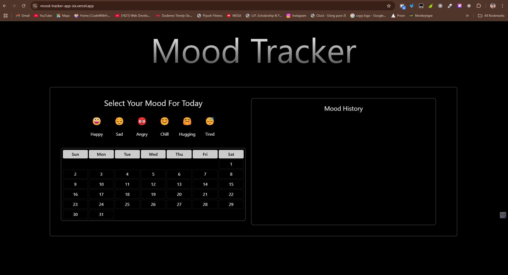
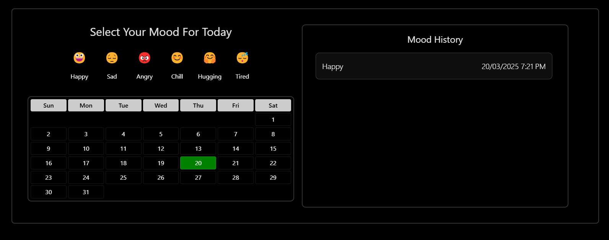
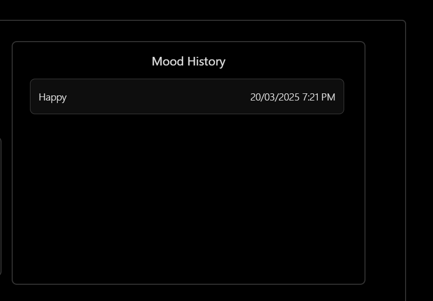

# Mood Tracker App

## Description

The Mood Tracker App allows users to track their daily moods using a simple and intuitive interface. Users can select their mood for the day, view a calendar with their mood history, and see a detailed list of past moods.

## Features

- Select and save your mood for the day using emoji buttons.
- View a dynamically generated calendar with mood indicators.
- See a detailed history of past moods.
- Data is stored locally using `localStorage`.

## Technologies Used

- HTML
- CSS (Tailwind CSS)
- JavaScript

## How to Use

1. Open the `index.html` file in your web browser.
2. Select your mood for the day by clicking on one of the emoji buttons.
3. View your mood history in the calendar and the detailed list.

## File Structure

- `index.html`: The main HTML file for the app.
- `style.css`: The CSS file for styling the app.
- `index.js`: The JavaScript file for handling user interactions and data storage.

## Deployment

You can access the deployed app at the following link:
[Deployment Link](https://mood-tracker-app-six.vercel.app/)

## Screenshots

